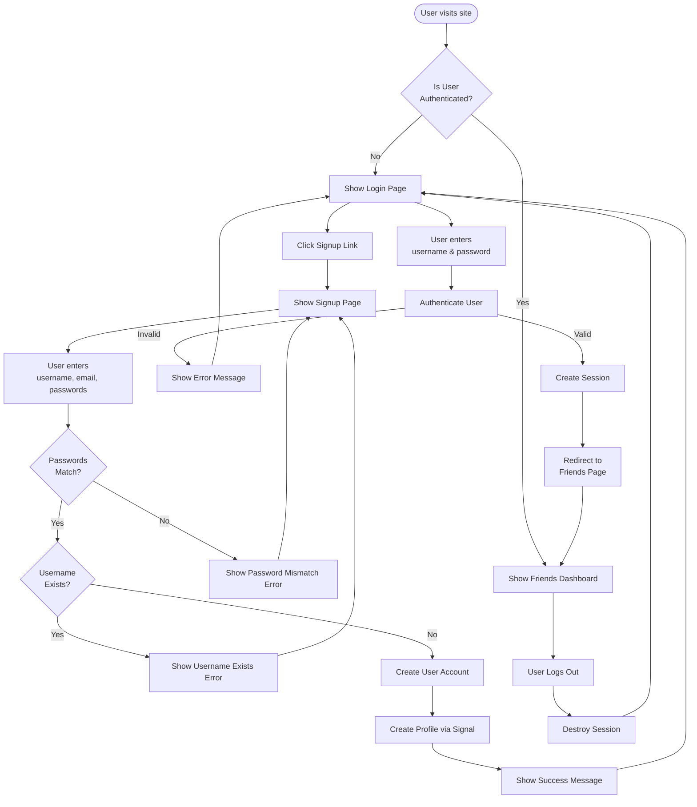
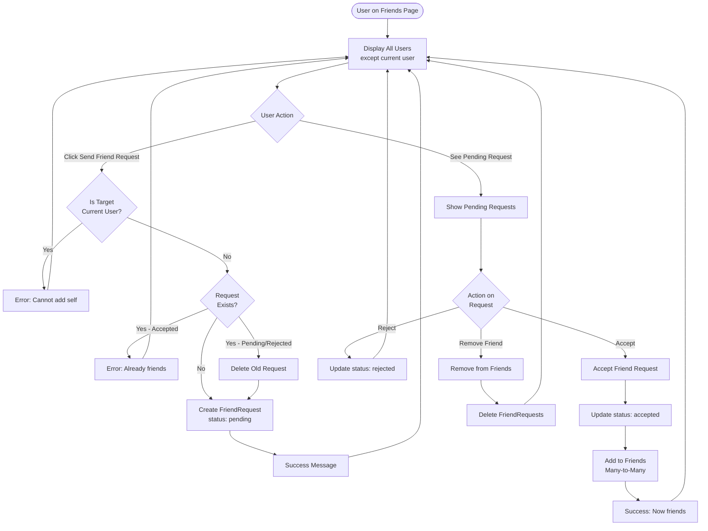
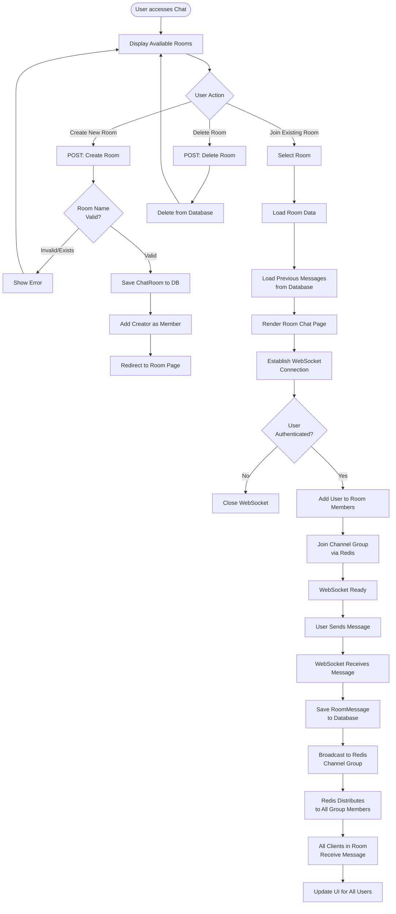
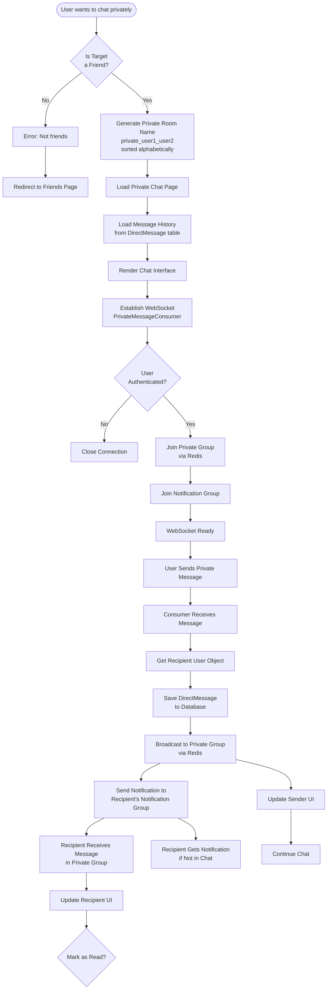
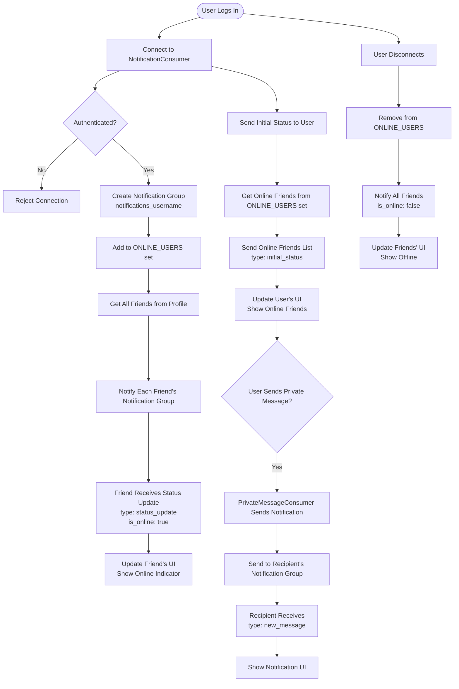
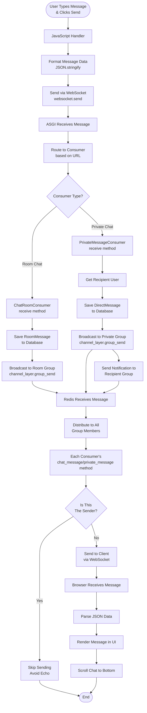

These workflows cover:
- User Authentication: Login, signup, logout
- Friend Management: Sending, accepting, rejecting requests
- Room Chat: Creating rooms, joining, sending messages
- Private Messaging: Friend verification, real-time chat
- WebSocket Flow: Connection establishment and message routing
- Online Status: Real-time presence updates
- Message Flow: End-to-end message sending process
- Use these in your documentation or README to explain how the application works.

## 1. User Authentication Flow

## 2. Friend Request Workflow

## 3. Room Chat Workflow

## 4. Private Message Workflow

## 5. WebSocket Connection & Message Flow

```mermaid
    flowchart LR
    Client[Browser Client] -->|1. WebSocket Connect| ASGI[ASGI Application]
    ASGI -->|2. Origin Check| OriginValidator[AllowedHostsOriginValidator]
    OriginValidator -->|3. Auth Check| AuthStack[AuthMiddlewareStack]
    AuthStack -->|4. Route| Router[WebSocket Router<br/>chat/routing.py]
    
    Router -->|Route to| Consumer[Consumer<br/>ChatRoom/Private/Notification]
    Consumer -->|5. Connect| AuthUser{User<br/>Authenticated?}
    
    AuthUser -->|No| Close[Close Connection]
    AuthUser -->|Yes| JoinGroup[Join Channel Group<br/>via Redis]
    JoinGroup -->|6. Accept| Accept[Accept WebSocket]
    Accept --> Connected[Connection Established]
    
    Connected -->|7. User Sends Message| Receive[Consumer Receives Message]
    Receive --> Process[Process Message]
    
    Process -->|Save to DB| SaveDB[(Database)]
    Process -->|Broadcast| Redis[(Redis Channel Layer)]
    
    Redis -->|8. Distribute| GroupMembers[All Group Members]
    GroupMembers -->|9. Send| AllClients[All Connected Clients]
    AllClients -->|10. Update UI| Client
    
    Connected -->|Disconnect| Disconnect[User Disconnects]
    Disconnect --> LeaveGroup[Leave Channel Group]
    LeaveGroup --> Cleanup[Cleanup Connection]

```

## 6. Online Status Notification Flow

## 7. Complete Message Sending Flow (Detailed)

